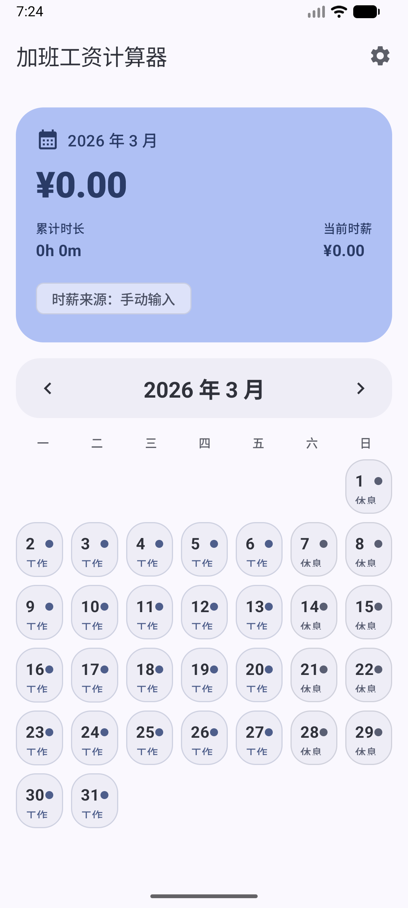
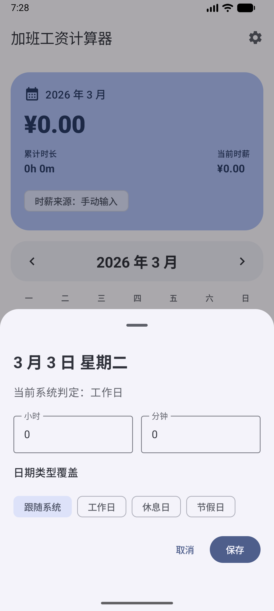
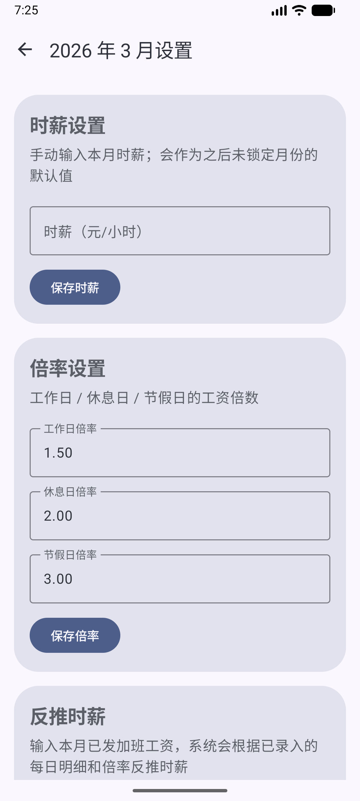

<p align="center">
  
</p>

<h1 align="center">加薪</h1>

<p align="center">
  一个为个人用户设计的原生 Android 加班工资计算器。
</p>

<p align="center">
  用月历记录每天的加班时长，按工作日 / 休息日 / 节假日倍率自动计算，并实时查看当月累计加班工资。
</p>

<p align="center">
  <a href="https://github.com/impersonal-byte/OvertimeCalculator/releases/tag/v1.2.0">下载 v1.2.0</a>
  ·
  <a href="#功能亮点">功能亮点</a>
  ·
  <a href="#界面预览">界面预览</a>
  ·
  <a href="#本地运行">本地运行</a>
</p>

<p align="center">
  
  
  
  
</p>

## 功能亮点

- 月历首页查看整月加班记录
- 点击日期快速录入小时和分钟
- 按工作日、休息日、法定节假日自动应用不同倍率
- 支持手动修改倍率
- 支持手动输入时薪
- 支持根据“已发加班工资”反推时薪
- 首页实时汇总当月累计加班工资和总时长
- 所有数据本地保存，可离线使用

## 为什么做这个项目

很多加班记录工具更偏排班或工时统计，不够贴近日常“我这个月到底能拿多少加班工资”这个问题。

“加薪”更关注两件事：

- 记录足够快：打开就能点日历填工时
- 结果足够直接：首页就能看到当月累计工资

## 界面预览

<p align="center">
  
  
  
</p>

## 计算规则

- 日期类型优先级
  - 用户手动覆盖
  - 内置节假日 / 调休数据
  - 周末判定
  - 普通工作日
- 默认倍率
  - 工作日：`1.5`
  - 休息日：`2.0`
  - 法定节假日：`3.0`
- 时薪反推公式
  - `时薪 = 已发加班工资 / 倍率加权小时数`

说明：

- 反推时薪依赖当月每日加班明细
- 如果只有月总时长，没有每天的日期类型分布，应用不会做模糊估算

## 技术栈

- Kotlin
- Jetpack Compose
- Material 3
- Navigation Compose
- Android ViewModel
- Room

## 当前状态

当前版本已支持：

- 月历首页展示
- 设置页导航
- 每日加班录入与保存
- 首页汇总实时刷新
- 手动设置时薪
- 反推时薪
- Android 自适应启动图标
- Room 本地存储
- 基础单元测试
- 基础 Compose UI 测试

## 本地运行

环境要求：

- Android Studio
- Android SDK
- JDK 17

构建调试包：

```powershell
.\gradlew.bat assembleDebug
```

运行单元测试：

```powershell
.\gradlew.bat testDebugUnitTest
```

运行设备或模拟器测试：

```powershell
.\gradlew.bat connectedDebugAndroidTest
```

调试 APK 输出位置：

```text
app/build/outputs/apk/debug/app-debug.apk
```

## 目录结构

```text
app/src/main/java/com/peter/overtimecalculator
|- data
|  |- db
|  \- repository
|- domain
\- ui
```

## 已知限制

- 当前数据只保存在本地设备
- 暂无云同步
- 暂无导出 Excel / CSV / PDF
- 暂无通知提醒和桌面组件
- 节假日数据仍有继续完善空间

## Roadmap

- 完善 Compose UI 回归测试
- 继续优化图标与品牌细节
- 补充更完整的节假日与调休数据
- 增加导出与备份能力

## License

本项目采用 [MIT License](./LICENSE)。
